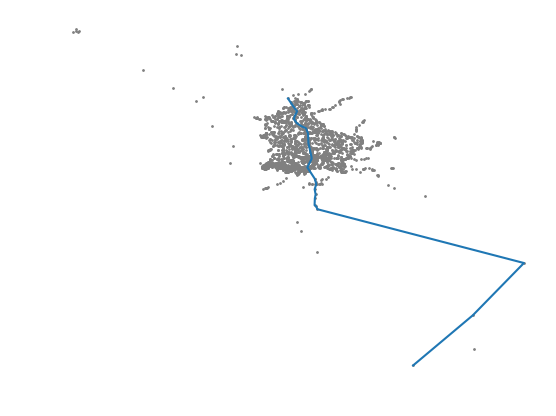

# Lab 2. La rete dei trasporti pubblici

***
**Componenti gruppo:**

- Federico Caldart , matricola: 1211144
- Stefano Panozzo, matricola: 1211143
- Davide Zago, matricola: 1211260

***

### Domanda 1

Per modellare la rete di trasporti pubblici abbiamo utilizzato un grafo così implementato:

1. I **nodi** identificano le stazioni e hanno come campi dato il nome, le coordinate (longitudine e latitudine) e la lista degli identificativi dei nodi adiacenti; gli identificativi non sono salvati come campo dato nei nodi stessi, ma vengono utilizzati all'interno del grafo, ognuno associato ad un oggetto di classe Node.

2. Gli **archi** identificano i collegamenti tra le stazioni e hanno come campi dato i tempi di partenza e arrivo, un identificativo della corsa e un peso calcolato come differenza tra i secondi a partire dalla mezzanotte del tempo di arrivo e i secondi a partire dalla mezzanotte del tempo di partenza: tale peso non sarà negativo poichè nessun collegamento tra due stazioni parte un giorno e arriva il successivo. Gli archi non memorizzano le due stazioni collegate, che vengono invece associate a oggetti di tipo Edge all'interno del grafo.

Nella classe che modella il grafo, nodi ed archi vengono gestiti con l'ausilio di due dizionari:

1. **nodes** è un dizionario che ha come chiavi gli identificativi delle stazioni e associa ad ogni chiave un solo oggetto di tipo node, cioè una stazione.

2. **edges** è un dizionario che ha come chiavi coppie di identificativi delle stazioni (nodi), in cui il primo indica la stazione di partenza ed il secondo quella di arrivo; ad ogni chiave è associata la lista di archi (cioè oggetti di tipo edge) che collegano le due stazioni, ognuno con identificativo e orari differenti: due stazioni saranno dunque collegate da 0, 1 o più archi.

### Domanda 2

Per risolvere il problema abbiamo utilizzato l'algoritmo di *Dijkstra*, implementando la coda di priorità con un *min-heap binario*.

Il *min-heap binario* è una struttura dati che consiste in un albero binario nel quale il valore dei figli è maggiore del valore del padre, in questo modo la radice conterrà sempre il valore più basso.  
L'heap viene implementato utilizzando un array nel quale la posizione *0* contienre un valore nullo mentre tutti i nodi dell'albero sono contenuti nelle altre posizioni con la regola che il nodo in posizione *i* avra come figlio sinistro il nodo in posizione *i\*2* e come figlio destro il nodo in posizione *i\*2+1*, abbiamo dunque utilizzato questa struttura per implementare la coda di priorità e in particolare i metodi significativi implementati sono:

- extractMin(): viene estratto il nodo in posizione *1* dell'array e viene rimpiazzato dall'ultimo nodo presente nell'array, successivamente se il valore della nuova radice è maggiore dei due figli si effettua uno scambio tra il figlio minore e la radice, questo procedimento si ripete in maniera ricorsiva sul sotto-albero che ha come radice il nodo appena scambiato finchè non si trova la posizione corretta del nodo all'interno dell'albero.

- InsertNode(n): l'operazione di inserimento del nodo mette in coda all'array e controlla che il suo valore sia maggiore di quello del padre, se non è così i due nodi vengono scambiati e questo procedimento si ripete finchè il nodo inserito è più grande del padre oppure quando diventa la radice.

- decreaseKey(n, value): l'oerazione di decremento di priorità di un nodo prima trova il nodo all'interno dell'heap, decrementa il suo valore e successivamente lo fa risalire se necessario con lo stesso procedimento utilizzato in insertNode(n).

L'algoritmo generico visto a lezione non può essere direttamente applicato al problema, poichè la soluzione di esso deve tener conto di una dipendenza dal tempo.
Questa dipendenza ha portato ad una modifica della funzione che calcola il peso effettivo *w(A, B)*: per scegliere il percorso più breve da A a B a partire dal tempo *t*, è necessario tenere conto anche del tempo di attesa da *t* all'orario di partenza delle corse A -> B oltre al tempo di percorrenza di esse; *t*, quando viene passato a *w(A, B, t)*, è uguale alla somma dell'orario  di partenza dal nodo sorgente (in secondi) con il tempo minimo necessario ad arrivare A.

E' stato poi aggiunto un controllo subito dopo l'estrazione del minimo nella heap, che fa terminare l'algoritmo nel caso siano rimasti solo nodi non raggiungibili a partire dal nodo sorgente.

Oltre ai predecessori ed ai pesi dei cammini minimi, ritorniamo gli orari di partenza e arrivo e gli identificativi delle corse nei cammini minimi, per facilitarne la stampa in seguito.

### Domanda 3

- Viaggio da **200415016** a **200405005**
~~~~ 
Orario di partenza: 09:30
Orario di arrivo: 09:52

09:30 : corsa 00360 RGTR da 200415016 a 200405026
09:40 : corsa 01797 AVL da 200405026 a 200405005
~~~~

- Viaggio da **300000032** a **400000122**
~~~~ 
Orario di partenza: 05:30
Orario di arrivo: 13:50

06:26 : corsa 07608 C88 da 300000032 a 110606001
06:35 : corsa 03781 C82 da 110606001 a 200405035
07:46 : corsa 00055 C82 da 200405035 a 400000047
12:07 : corsa 09879 C82 da 400000047 a 400000122
~~~~

- Viaggio da **210602003** a **300000030**
~~~~ 
Orario di partenza: 06:30
Orario di arrivo: 10:53

06:41 : corsa 00030 CFLBUS da 210602003 a 210502001
06:55 : corsa 00031 CFLBUS da 210502001 a 201103004
07:07 : corsa 01306 CFLBUS da 201103004 a 201103001
07:09 : corsa 00031 CFLBUS da 201103001 a 200301002
07:11 : corsa 01306 CFLBUS da 200301002 a 200301003
07:12 : corsa 00031 CFLBUS da 200301003 a 200404028
07:19 : corsa 01306 CFLBUS da 200404028 a 200404016
07:20 : corsa 00031 CFLBUS da 200404016 a 200405036
07:24 : corsa 01173 RGTR da 200405036 a 200405026
07:27 : corsa 04278 AVL da 200405026 a 200405035
07:40 : corsa 07630 C82 da 200405035 a 300000030
~~~~

- Viaggio da **200417051** a **140701016**
~~~~ 
Orario di partenza: 12:00
Orario di arrivo: 12:43

12:20 : corsa 03712 C82 da 200417051 a 140701016
~~~~

- Viaggio da **200417051** a **140701016**
~~~~ 
Orario di partenza: 23:55
Orario di arrivo: 00:44

00:09 : corsa 03623 C82 da 200417051 a 140701016
~~~~
.png)

- Viaggio da **130208003** a **400000129**
~~~~ 
Orario di partenza: 11:34
Orario di arrivo: 13:21

07:06 : corsa 01892 RGTR da 130208003 a 130203002
07:18 : corsa 01875 RGTR da 130203002 a 140203001
07:28 : corsa 03433 RGTR da 140203001 a 140401004
07:39 : corsa 03528 CFLBUS da 140401004 a 140701016
07:46 : corsa 00457 C82 da 140701016 a 200405035
08:20 : corsa 04708 C82 da 200405035 a 200415004
08:25 : corsa 02011 AVL da 200415004 a 200412018
08:36 : corsa 07223 RGTR da 200412018 a 400000099
13:01 : corsa 05860 RGTR da 400000099 a 400000129
~~~~

- Viaggio da **110812001** a **170705002**
~~~~ 
Orario di partenza: 16:03
Orario di arrivo: 18:21

16:26 : corsa 08693 RGTR da 110812001 a 110101002
16:44 : corsa 03741 C82 da 110101002 a 140701016
17:17 : corsa 06009 RGTR da 140701016 a 140701024
17:20 : corsa 01646 RGTR da 140701024 a 140701026
17:22 : corsa 06009 RGTR da 140701026 a 140701018
17:23 : corsa 01646 RGTR da 140701018 a 140503001
17:36 : corsa 03035 RGTR da 140503001 a 180509002
17:57 : corsa 00229 CFLBUS da 180509002 a 170201002
18:03 : corsa 00092 CFLBUS da 170201002 a 170501016
18:15 : corsa 02212 CFLBUS da 170501016 a 170705002
~~~~

- Viaggio da **180305002** a **200426007**
~~~~ 
Orario di partenza: 22:18
Orario di arrivo: 07:13

06:18 : corsa 02892 RGTR da 180305002 a 200417050
06:53 : corsa 02565 RGTR da 200417050 a 200417047
06:59 : corsa 01185 RGTR da 200417047 a 200417005
07:03 : corsa 03546 AVL da 200417005 a 200426007
~~~~

### Domanda 4

Le soluzioni di viaggio calcolate dalla nostra soluzione sono ottime come tempistiche (escludendo i tempi che nella realtà sono necessari per spostamenti tra le linee), tuttavia può accadere che nella scelta del cammino minimo vengano fatti inutili cambi. Per esempio, nella soluzione di viaggio da 210602003 a 300000030, 00031 CFLBUS e 01306 CFLBUS si alternano per 6 volte: ciò accade perchè, nonostante le due linee percorrano le stesse stazioni, esse impiegano alternativamente meno tempo nelle sotto-tratte (contando il tempo d'attesa), dunque l'algoritmo le valuta alternativamente ottime per i sotto problemi.
E' possibile migliorare i cammini tenendo traccia delle linea che mi ha portato alla stazione da cui voglio ripartire, per esempio incrementando il peso nel caso in cui sia necessario fare un cambio: ciò potrebbe anche rendere le soluzioni più realistiche, in quanto l'incremento può essere visto come il tempo necessario allo spostamento reale tra le diverse linee.

