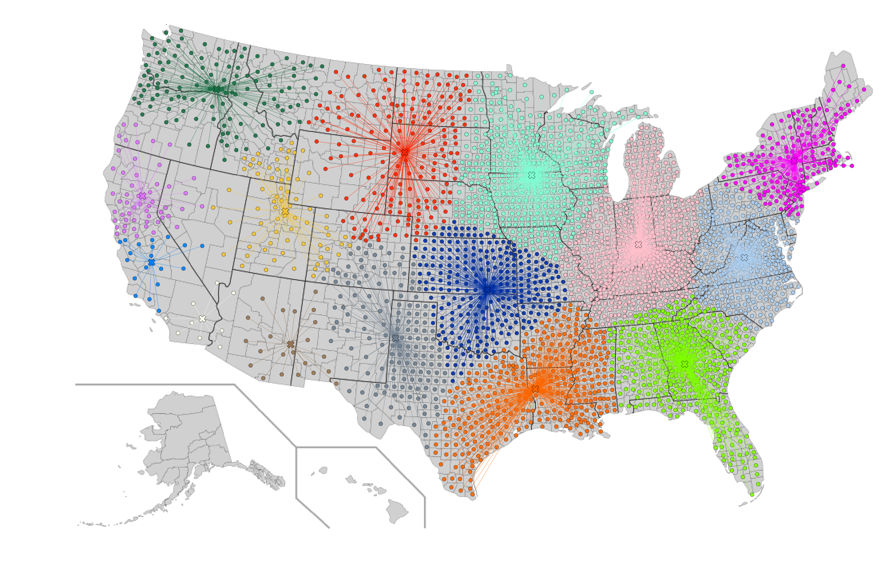

# Lab. 3 - Il Commesso Viaggiatore

***
**Componenti gruppo:**

- Federico Caldart , matricola: 1211144
- Stefano Panozzo, matricola: 1211143
- Davide Zago, matricola: 1211260

***
## Efficienza

### Domanda 1

    

	 
    

### Domanda 2

    

	 
    

### Domanda 3

## Automazione

### Domanda 4
###### Gerarchico

    

	 
    

### Domanda 5
###### kmeans

    

	 
    

### Domanda 7
Visto che il clustering k means viene inizializzato utilizzando

## Qualità

