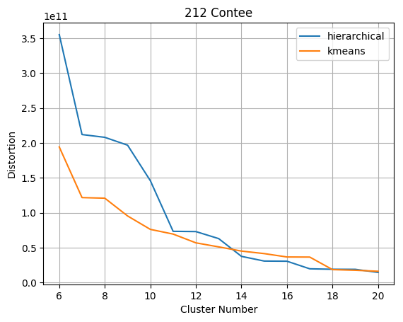
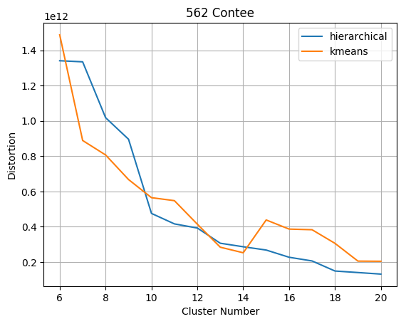
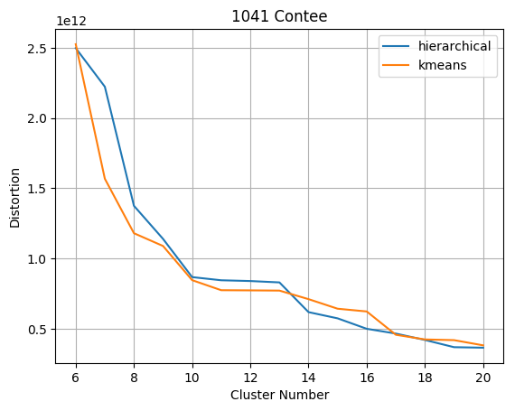

# Lab. 4 - Clustering di dati medici

**Componenti gruppo:**

- Federico Caldart , matricola: 1211144
- Stefano Panozzo, matricola: 1211143
- Davide Zago, matricola: 1211260
***

## Efficienza

### Domanda 1

<div class="outer">
    <div class="inner">
	 
	<figcaption>Fig.1: Clustering gerarchico - 3108 contee</figcaption>
    </div>
</div>

<div style="page-break-after: always;"></div>

### Domanda 2

<div class="outer">
    <div class="inner">
	 
	<figcaption>Fig.2: Clustering k-means - 3108 contee</figcaption>
    </div>
</div>

<div style="page-break-after: always;"></div>

### Domanda 3

Quando il numero di cluster richiesti in output è molto più piccolo del numero totale di punti, il clustering gerarchico è sicuramente molto più lento del clustering k-means con un numero piccolo di iterazioni; ad esempio, per ottenere i 15 cluster in Fig.1 , ci sono voluti all'incirca **3 minuti** con hierarchical, mentre per ottenere i 15 cluster in Fig.2 sono bastati **0.14 secondi** utilizzando k-means con 5 iterazioni. Infatti:

- Il clustering gerarchico utilizza la funzione *FastClosestPair* per trovare le coppie di punti più vicini, che ha complessità *O(nlogn)* cosiderando il preordinamento. Osservando la nostra implementazione, però, è necessario fare delle considerazioni aggiuntive; per fare ciò riportiamo alcune righe significative di codice, analizzandone e commentandone la complessità.

```python

""" n = numero di punti, k = numero di cluster in output,
 i = iterazione (0...n-k) """

    while len(clusters) > k:  # n-k iterazioni (1)
        centers = clusters.keys()

        points = sorted(centers, key=lambda k: k[0]) # (n-i)*log(n-i) (2)
        S = sorted(centers, key=lambda k: k[1]) # (n-i)*log(n-i)  (3)

        _, i, j = fast_closest_pair(points, S) # (n-i)*log(n-i) (4)

        clusters[calc_center(clusters[i]+clusters[j])] = clusters[i]+clusters[j] 
        # lunghezza(cluster i-esimo + cluster j-esimo)  (5)
        del clusters[i]
        del clusters[j]

``` 
<span class="reddo"> (1) </span>: l'algoritmo itera finchè non ha trovato esattamente k cluster, dunque n-k volte; 
<span class="reddo"> (2) </span> e <span class="reddo"> (3) </span>: ad ogni iterazione i, viene effettuato un ordinamento su n-i punti;
<span class="reddo"> (4) </span>: ad ogni iterazione i viene chiamata la funzione fast_closest_pair su n-i punti;
<span class="reddo"> (5) </span>: ad ogni iterazione viene ricalcolato il nuovo centro con il metodo calc_center(points), che è lineare rispetto al numero di punti in input e tali punti saranno al massimo n;

Possiamo dunque riassumere la complessità in tempo dell'algoritmo nel seguente modo: (n-k)\*(3\*n\*log(n) + n); dato che stiamo considerando k << n, possiamo definire la complessità asintotica come **O( n² \* log(n) )**.

- Anche per il clustering k-means riportiamo e analizziamo alcune importanti righe di codice : 

```python
""" n = numero di punti, k = numero di cluster in output,
 q = numero di iterazioni """
 
def kmeans(P, k, q):
    sortedP = sorted(P, key=lambda c: c.population, reverse=True) # n*log(n) (1)

    centers = [(sortedP[i].x, sortedP[i].y) for i in range(k)]

    clusters = defaultdict(list)
  
    for i in range(q): # q iterazioni (2)
        clusters = partition(P, centers) # n * k (3)
        if i == q-1:
            old_centers = centers.copy() # k, ma viene eseguito una sola volta (4)
        for j in range(k): # k iterazioni (5)
            centers[j] = calc_center(clusters[centers[j]]) 
            #lunghezza(cluster j-esimo) (5.5)

    for i in range(k): # k iterazioni (6)
        clusters[centers[i]] = clusters[old_centers[i]]
        if centers[i] != old_centers[i]:
            del clusters[old_centers[i]]

    return clusters
``` 
<span class="reddo"> (1) </span>: viene effettuato un preordinamento della lista degli n punti;
<span class="reddo"> (2) </span>: l'algoritmo itera q volte;
<span class="reddo"> (3) </span>: una chiamata a partition calcola ∀ punto la distanza da ogni centro;
<span class="reddo"> (4) </span>: all'ultima iterazione vengono copiati e salvati gli ultimi centroidi calcolati;
<span class="reddo"> (5) e (5.5) </span>: l'algoritmo chiama calc\_center sui punti di ogni cluster (k volte); tuttavia, ogni chiamata a calc\_center ha in input una frazione degli n punti e la somma di queste frazioni è esattamente n, dunque (5) e (5.5) possono essere raggruppati in:
 *Σ\_i∈{0..k} lunghezza(cluster[i]) = n*
 <span class="reddo"> (6) </span>: vengono effettuate 3 operazioni in tempo O(1) k volte;
 
 Possiamo dunque riassumere la complessità in tempo dell'algoritmo nel seguente modo: **n\*log(n) + q\*n\*k + n + k**); dato che stiamo considerando k, q << n, possiamo definire la complessità asintotica come **O(n\*log(n) + q\*n\*k)**; in particolare considerando la crescita lenta del logaritmo, possiamo ridurre la complessità a **O(q\*n\*k)  con  n <= 2^k*q ** 

## Automazione

### Domanda 4

<div class="outer">
    <div class="inner">
	 
	 <figcaption>Fig.3: Clustering gerarchico - 212 contee</figcaption>
    </div>
</div>

<div style="page-break-after: always;"></div>

### Domanda 5

<div class="outer">
    <div class="inner">
	 
	<figcaption>Fig.4: Clustering k-means - 212 contee</figcaption>
    </div>
</div>

<div style="page-break-after: always;"></div>

### Domanda 6

<table>
  <tr>
  <th>Metodo</th>
  <th>Distorsione</th>
  </tr>
  <tr>
    <th>Clustering gerarchico</th>
    <td>1.96752e+11</td>
  </tr>
  <tr>
    <th>Clustering k-means </th>
    <td>9.53828e+10</td>
  </tr>
 </table>
### Domanda 7
Dalle figure si nota che le contee della costa occidentale con il clustering gerarchico vengono raggruppate in due cluster, di cui uno contiene una sola contea, mentre con il clustering kmeans vengono raggruppati in 4 diversi cluster.
Questo accade perché i centri iniziali di kmeans sono le 15 contee più popolate e 4 di queste sono sulla costa occidentale. Durante le iterazioni del metodo kmeans i quattro centri sulla costa occidentale non riescono a spostarsi e catturano un numero molto basso di punti,
per questo motivo la distorsione di kmeans risulta più elevata.
Per risolvere questo problema si può pensare ad una inizializzazione migliore dei centri che rappresenti meglio la distribuzione del dataset sul piano.

### Domanda 8
Il metodo di clustering gerarchico assicura una distorsione relativamente bassa anche senza particolari accorgimenti al contrario di kmeans che richiede una inizializzazione corretta, cioè richiede una conoscenza a priori della distribuzione dei punti.

<div style="page-break-after: always;"></div>

## Qualità

### Domanda 9


<figcaption class="dist">Fig.5: Confronto distorsione - 212 contee</figcaption>

 
<figcaption class="dist">Fig.6: Confronto distorsione - 562 contee</figcaption>

 
<figcaption class="dist"> Fig.7: Confronto distorsione - 1041 contee</figcaption>

<div style="page-break-after: always;"></div>

### Domanda 10
Dai grafici si nota che nessuno dei due metodi porta ad ottenere sempre cluster con distorsione più bassa, infatti le curve si incrociano diverse volte. Si può notare però che nel caso delle 212 contee il metodo kmeans ottiene un clustering con distorsione minore rispetto al metodo gerarchico quando il numero di cluster è basso, questo probabilmente accade perchè la selezione dei centri con cui viene inizializzato kmeans in questo caso risulta efficace.


